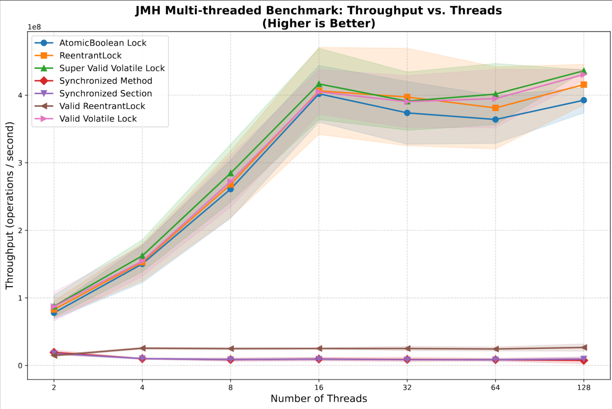
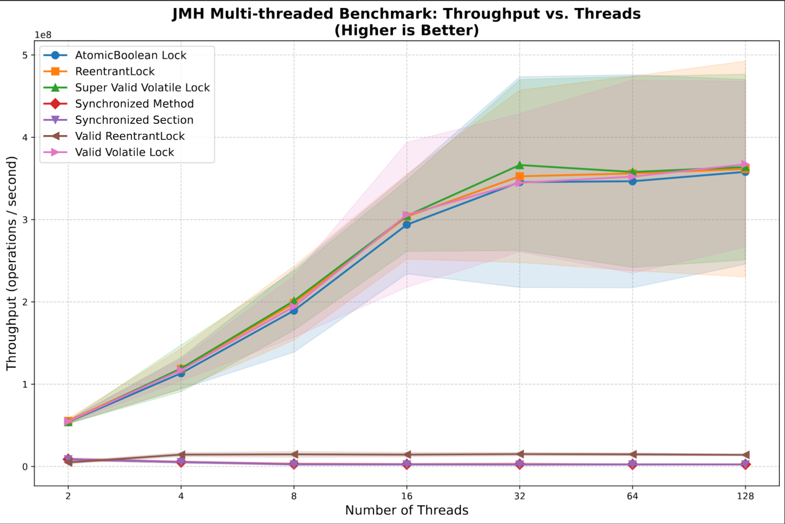

# 🔬 Java UniqueList Performance Benchmark

[](https://openjdk.org/)
[](https://github.com/openjdk/jmh)
[](https://junit.org/)

## 📋 О проекте

**UniqueList Benchmark** — это исследовательский проект, демонстрирующий различные подходы к реализации потокобезопасной коллекции, которая гарантирует уникальность элементов. Проект включает сравнение производительности синхронизированных и lock-free реализаций в многопоточной среде с использованием Java Microbenchmark Harness (JMH).

### 🎯 Основная задача

Создать коллекцию `IUniqueList<T>`, которая:
- Хранит только уникальные элементы (без дубликатов)
- Корректно работает в многопоточной среде
- Обеспечивает максимальную производительность

Проект исследует поведение различных синхронизационных механизмов при нагрузке от 2 до 128 потоков, включая адаптивные спин-локи и сравнение tryLock() vs lock().

## 📈 Визуализация результатов

### AMD Ryzen (Lenovo T14 Gen1)

*График 1. Throughput (M ops/sec) на AMD Ryzen*

### Intel Core (Lenovo X1 Gen12)
  
*График 2. Throughput (M ops/sec) на Intel Core*


## 📊 Результаты бенчмарков (AMD Ryzen)

Throughput (M ops/sec) при разном количестве потоков

### Тестирование на AMD Ryzen (Lenovo T14 Gen1)
```text
| Implementation          | 2 потока | 4 потока | 8 потоков | 16 потоков | 32 потока | 64 потока | 128 потоков |
|-------------------------|----------|----------|-----------|------------|-----------|-----------|-------------|
| Synchronized Method     | 19.4     | 10.1     | 8.6       | 9.5        | 8.9       | 8.6       | 7.5         |
| Synchronized Section    | 17.9     | 10.1     | 8.7       | 9.3        | 8.4       | 8.5       | 9.6         |
| **AtomicBoolean Lock**  | **77.9** | **150.3**| **261.0** | **402.0**  | **373.8** | **364.0** | **392.5**   |
| **Valid Volatile Lock** | **87.2** | **154.4**| **272.5** | **404.9**  | **390.4** | **395.0** | **430.6**   |
| **SuperValid Volatile** | **87.7** | **162.3**| **284.6** | **416.6**  | **391.2** | **401.6** | **436.1**   |
| **ReentrantLock**       | **82.9** | **152.8**| **267.9** | **406.3**  | **397.2** | **381.2** | **415.7**   |
| ValidReentrantLock      | 14.7     | 25.5     | 24.9      | 25.1       | 25.1      | 24.4      | 26.6        |
```

### Тестирование на Intel (Lenovo X1 Gen12)
```text
| Implementation         | 2 потока | 4 потока | 8 потоков | 16 потоков | 32 потока | 64 потока | 128 потоков |
|------------------------|----------|----------|-----------|------------|-----------|-----------|-------------|
| Synchronized Method    | 8.8      | 5.4      | 3.0       | 2.6        | 2.7       | 2.5       | 2.6         |
| Synchronized Section   | 8.7      | 5.3      | 2.6       | 2.5        | 2.4       | 2.4       | 2.5         |
| **AtomicBoolean Lock** | **54.2** | **113.3**| **189.5** | **293.8**  | **345.6** | **346.6** | **358.0**   |
| **Valid Volatile Lock**| **54.7** | **117.1**| **194.3** | **305.8**  | **344.7** | **352.2** | **367.3**   |
| **SuperValid Volatile**| **53.9** | **119.2**| **201.3** | **304.6**  | **366.3** | **357.9** | **363.9**   |
| **ReentrantLock**      | **55.4** | **118.7**| **198.5** | **303.6**  | **352.6** | **356.1** | **361.5**   |
| ValidReentrantLock     | 4.9      | 14.4     | 14.8      | 14.5       | 15.1      | 14.8      | 14.1        |
```
### 🔍 Ключевые наблюдения

1. **AMD vs Intel**: AMD показывает в 1.5-2 раза более высокую пропускную способность на всех реализациях, особенно на lock-free подходах (AtomicBoolean, Volatile locks).

2. **Масштабируемость**:
   - На AMD лучшие результаты достигаются при **16-32 потоках** (до 430 M ops/sec)
   - На Intel пик производительности приходится на **64-128 потоков** (до 367 M ops/sec)
   - `SuperValidVolatile` показывает наилучшие результаты на обоих процессорах

3. **Аномалия ValidReentrantLock**: 
   - Показывает unexpectedly низкие результаты (14-26 M ops/sec) по сравнению с обычным ReentrantLock
   - **Причина**: использует блокирующий `lock()` вместо `tryLock()` с циклом, что приводит к частым переключениям контекста
   - Хороший пример того, как **важно не только что, но и как** вы используете примитивы синхронизации!

4. **GC активность**:
   - Lock-free реализации (`AtomicBoolean`, `ValidVolatile`) практически не вызывают GC
   - `ValidReentrantLock` генерирует заметную GC активность (3-6 collections за измерение)


## 🏗 Архитектура
```
┌─────────────────┐
│ IUniqueList     │
│ (interface)     │
└────────┬────────┘
         │
┌────────▼──────────┐
│SimpleNonUniqueList│
│ (базовый класс)   │
└────────┬──────────┘
         │
    ┌────┴──────┐
    │           │
┌───▼───┐ ┌─────▼──────┐
│Simple │ │Synchronized│
│Unique │ │ Method     │
└───────┘ └────────────┘
... и другие реализации
```
## ⚙️ Реализации

### 1. **SimpleUniqueList** (Эталон)
Базовая несинхронизированная реализация. Используется как reference point для сравнения.

### 2. **Synchronized Method**
```java
public synchronized boolean add(T e) {
    if (!list.contains(e)) {
        return list.add(e);
    }
    return false;
}
```
Синхронизация на уровне метода — самый простой, но потенциально медленный подход.

### 3. Synchronized Section
```java
@Override
public boolean add(T e) {
    synchronized (list) {
        if (!list.contains(e)) {
            list.add(e);
            return true;
        }
        return false;
    }
}
```
Синхронизация на объекте списка — более тонкий контроль над критической секцией.
### 4. ReentrantLock
```java
while (!added && !list.contains(e)) {
    if (lock.tryLock()) {
        try { /* критическая секция */ } 
        finally { lock.unlock(); }
    } else {
        Thread.yield();
    }
}
```
Использование ReentrantLock с неблокирующей попыткой захвата.

### 5. AtomicBoolean Lock
```java
while (!added && !list.contains(e)) {
    if (islocked.compareAndSet(false, true)) {
        try { /* критическая секция */ } 
        finally { islocked.set(false); }
    } else {
        Thread.yield();
    }
}
```
Самодельный spin-lock на основе AtomicBoolean и CAS-операций.

### 6. Valid Volatile Lock
```java
private volatile boolean islocked = false;

private boolean tryLock() {
    if (islocked) return false;
    synchronized(list) {
        if (!islocked) {
            islocked = true;
            return true;
        }
        return false;
    }
}
```
Комбинация volatile для быстрой проверки и synchronized для атомарности.

### 7. **SuperValidVolatileLock**
```java
private void lock() {
    int spins = 0;
    while (!tryLock()) {
        if (spins++ < 100) continue;
        else if (spins < 1000) Thread.onSpinWait();
        else Thread.sleep(1);
    }
}
```
Улучшенная volatile-реализация с адаптивным спиннингом — сначала быстрый цикл, затем onSpinWait(), и только потом сон. Оптимальна для высоких нагрузок.

### 8. ValidReentrantLock
```java
@Override
public boolean add(T e) {
    lock();
    try {
        if (!list.contains(e)) return list.add(e);
        return false;
    } finally {
        unlock();
    }
}
```
Корректная реализация на ReentrantLock с блокирующим захватом (в отличие от tryLock() с циклом). Проще и надежнее.

### 9. ⚠️ NonValidVolatileLock
Демонстрация некорректной реализации — когда лочит в одном потоке, то не позволяет другим потокам добавлять элементы.

## Сборка и тестирование
```bash
# Сборка без тестов ( почти мгновенно )
mvn clean package -DskipTests

# Сборка с тестами ( занимет несколько минут )
mvn clean package

# Запуск бенчмарка
mvn test -Dtest=org.fedorov.uniq.lists.MultiThreadUniqueListBenchmark

# Генерация отчета с графиками
cd scripts
./report.sh ../results/multithread-results.json report.py
```

## 📈 Визуализация
Скрипт report.py генерирует:

📊 Сравнительные графики производительности
📈 Индивидуальные графики для каждой реализации
📑 PDF-отчет со сводными таблицами
📁 CSV-файлы для дальнейшего анализа


## 🔍 Тестирование корректности
Проект включает комплексные тесты:

✅ Однопоточные сценарии
✅ Многопоточные сценарии с CountDownLatch
✅ Тесты с "медленными" операциями для выявления race conditions
✅ Валидация уникальности элементов

📚 Структура проекта
```text
src/
├── main/
│   └── java/org/fedorov/uniq/lists/
│       ├── IUniqueList.java           # Интерфейс
│       └── impl/                      # Реализации
│           ├── SimpleNonUniqueList.java
│           ├── SimpleUniqueList.java
│           ├── SynchronizedMethodUniqueList.java
│           ├── SynchronizedSectionUniqueList.java
│           ├── ReentrantLockedUniqueList.java
│           ├── ValidReentrantLockedUniqueList.java
│           ├── AtomicBooleanLockedUniqueList.java
│           ├── ValidVolatileLockedUniqueList.java
│           ├── SuperValidVolatileLockedUniqueList.java
│           └── NonValidVolatileLockedUniqueList.java
│
└── test/
    └── java/org/fedorov/uniq/lists/
        ├── IUniqueListJUnitTest.java  # Junit Параметризованные тесты
        └── MultiThreadUniqueListBenchmark.java # JMH бенчмарк
```